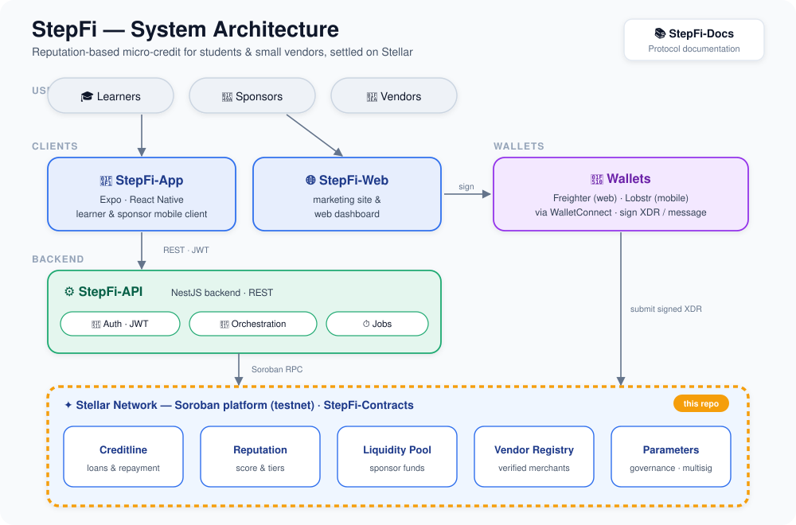

<div align="center">

# StepFi-Contracts

**Soroban smart contracts powering StepFi — reputation-based, collateral-light credit on Stellar.**

Credit, reputation, and a shared liquidity pool, enforced on-chain in Rust.

[](https://github.com/StepFi-app/StepFi-Contracts/actions/workflows/contracts-ci.yml)
[](https://www.rust-lang.org)
[](https://soroban.stellar.org)
[](https://stellar.expert/explorer/testnet)
[](#-build--test)
[](./LICENSE)

[What is StepFi](#-what-is-stepfi) · [Contracts](#-the-contracts) · [How credit works](#-how-credit-works) · [Deployments](#-deployed-on-testnet) · [Build](#-build--test) · [Roadmap](#-roadmap)

</div>

---

## 📖 What is StepFi?

StepFi extends small, uncollateralized loans to learners and interns based on an **on-chain reputation score** rather than assets. Sponsors fund a shared **liquidity pool**; borrowers draw loans sized and priced by their reputation, repay in installments, and grow their score — unlocking larger limits and lower rates. Vendors are paid directly and tracked in a registry. Everything that touches money or trust is enforced by the contracts in this repository.

## 🗺️ Where it fits

This repo is the **settlement and trust layer** of the StepFi protocol. Clients ([StepFi-App](https://github.com/StepFi-app/StepFi-App), [StepFi-Web](https://github.com/StepFi-app/StepFi-Web)) and the [StepFi-API](https://github.com/StepFi-app/StepFi-API) build and submit transactions to these contracts on Stellar.

<div align="center">



</div>

## 🧩 The contracts

A 6-crate Cargo workspace under [`contracts/`](contracts):

| Contract | Responsibility | Status |
|----------|----------------|--------|
| **Creditline** | Loan lifecycle — request, approve, fund, repay (per-installment), late fees, grace period, default, cancel | ✅ deployed |
| **Reputation** | 0–100 score, boosts, updater-gated writes; drives limits & APR | ✅ deployed |
| **Liquidity Pool** | Sponsor deposits, share pricing, loan funding, repayment/interest distribution, loss absorption, outflow & merchant-exposure caps | ✅ deployed |
| **Vendor Registry** | Vendor lifecycle (register → approve → suspend/deactivate) and active-status checks | ✅ deployed |
| **Parameters** | On-chain governance — protocol parameters + multisig proposal/approval/execution | ✅ deployed |
| **Vouching** | Mentor vouches that boost reputation, with on-chain expiry | 🚧 pending deployment |

## 💳 How credit works

A borrower's **reputation score (0–100)** determines both their credit limit and interest rate. The mapping is enforced in the Creditline contract:

| Score | APR | Credit limit |
|------:|----:|-------------:|
| 90–100 | 4% | 10,000 |
| 75–89 | 6% | 5,000 |
| 60–74 | 8% | 2,500 |
| below 60 | 10% | 1,000 |

- A minimum score (default **50**) is required to open a loan.
- Loans require a **guarantee** (default 20% of principal) and repay in installments; paying on time raises the score, defaulting applies a penalty.
- **Late fees** accrue per overdue installment; an optional grace period is governable.
- These brackets are compile-time constants; the penalty/threshold/fee parameters and an optional base interest rate are adjustable through the **Parameters** contract's multisig governance.

## 🔗 How the contracts interact

```
Sponsor ──deposit──▶ Liquidity Pool ──fund_loan──▶ Creditline ──pay──▶ Vendor
                                    ◀─repayment──┘
Creditline ──reads/updates──▶ Reputation   (score → limit & APR)
Creditline ──validates──────▶ Vendor Registry (active merchants only)
Parameters ──governs────────▶ all contracts (thresholds, fees, caps)
Vouching ──boosts───────────▶ Reputation
```

Creditline propagates reputation-call failures so loan state and reputation never diverge; the Liquidity Pool caps per-transaction outflow and per-merchant exposure.

## 🚀 Deployed on testnet

Canonical addresses from [`contracts/deployed-testnet.json`](contracts/deployed-testnet.json) — network **testnet**, deployed 2026-05-11 (Creditline redeployed 2026-05-12), last verified 2026-07-17.

| Contract | Address (click to explore) |
|----------|----------------------------|
| Parameters | [`CCAE72SK…IJ5B`](https://stellar.expert/explorer/testnet/contract/CCAE72SKYX55C5L56DBEFIMFVXRUIJY6JYLBREHEWRFNOW7AX5NBIJ5B) |
| Reputation | [`CC3BO57Z…L5SB`](https://stellar.expert/explorer/testnet/contract/CC3BO57ZRJGA63QJBIBSOMI25Z3X2I5CYTARYRAUXUAILX6L3OWBL5SB) |
| Vendor Registry | [`CCZ6T6NY…AU2L`](https://stellar.expert/explorer/testnet/contract/CCZ6T6NYCDNI26VGTPXKKWQDR7JCIZZ24LCEG4MMYHZJAG6BPWIVAU2L) |
| Liquidity Pool | [`CACKE7ML…S2BT`](https://stellar.expert/explorer/testnet/contract/CACKE7ML2BTOAGQTAAW5NEARHCFX4PXXKGEO6GMU6NHFBVYQFZRJS2BT) |
| Creditline | [`CAQDHYG3…BS3X`](https://stellar.expert/explorer/testnet/contract/CAQDHYG3TALPNXG466SZUMJEPOI7VYV732LPFF3GHE4ASPBCNMIQBS3X) |
| Vouching | pending deployment |

- **Deployer:** `GCOYDYSEHRCFWGXUCMPSQ3ODEY2LGMBSVKKCOFH4NRIK4DEEDSETH7BF`
- **Settlement token:** native XLM via SAC `CDLZFC3SYJYDZT7K67VZ75HPJVIEUVNIXF47ZG2FB2RMQQVU2HHGCYSC`

> ⚠️ An unrelated 2026-06-23 deployment from an unrecognized key is recorded as `orphanedDeployment` / **abandoned — do not use**. Only the addresses above are canonical.

## 🛡️ Security & governance

- **`require_auth()`** guards every mutating entry point; **reentrancy guards** across contracts.
- **Timelocked WASM upgrades** — propose → wait `upgrade_delay` → execute, with hash matching and version overflow checks.
- **Multisig governance** (Parameters) hardened against stale approvals, duplicate signatures, and admin bypass.
- **Emergency pause/unpause** on Creditline and Liquidity Pool.
- **Economic safeguards** — first-depositor share-price inflation mitigation, outflow & merchant-exposure caps, guarantee handling on cancel/default.
- `overflow-checks = true` and `panic = "abort"` in release; `cargo fmt` + `clippy -D warnings` enforced in CI.

Each contract exposes a typed `#[contracterror]` enum (e.g. `CreditLineError`, `LiquidityPoolError`, `ParametersError`) for precise, non-panicking failure codes. See [VERIFICATION.md](VERIFICATION.md) for build/verification details.

## 🔧 Build & test

### Prerequisites

| Tool | Notes |
|------|-------|
| Rust (stable) | via [rustup](https://rustup.rs) |
| `wasm32-unknown-unknown` | `rustup target add wasm32-unknown-unknown` |
| Stellar CLI | optional, for deployment |

```bash
git clone https://github.com/StepFi-app/StepFi-Contracts.git
cd StepFi-Contracts

cargo build                                              # build the workspace
cargo test                                               # run the test suite
cargo fmt --all -- --check                               # formatting gate
cargo clippy --workspace --all-targets -- -D warnings    # lint gate
```

A [`Makefile`](Makefile) provides shortcuts, and [`scripts/deploy-testnet.sh`](scripts/deploy-testnet.sh) deploys and initializes the full set to testnet.

### Test coverage

| Crate | Tests |
|-------|------:|
| Creditline | 148 |
| Liquidity Pool | 125 |
| Reputation | 60 |
| Parameters | 34 |
| Vouching | 27 |
| Vendor Registry | 26 |
| **Total** | **420** |

## 🔄 CI/CD

[`contracts-ci.yml`](.github/workflows/contracts-ci.yml) runs on every push/PR: `cargo fmt --check`, builds each dependency WASM, `clippy -D warnings`, workspace build, and `cargo test --locked` — a **required check on `main`**. Tagging `v*` triggers [`release.yml`](.github/workflows/release.yml): builds all contract WASMs, emits SHA-256 hashes, and publishes a GitHub Release.

## 🛣️ Roadmap

| Milestone | Status |
|-----------|--------|
| Five core contracts deployed to testnet | ✅ |
| Multisig governance + timelocked upgrades | ✅ |
| Liquidity-pool economic-attack hardening | ✅ |
| Per-installment late fees + emergency pause | ✅ |
| `fmt` + `clippy` CI gate | ✅ |
| Vouching contract deployment | 🚧 |
| Security audit & mainnet readiness | 🗺️ |

See [ROADMAP.md](ROADMAP.md) for the detailed protocol roadmap.

## 🤝 Contributing

This repo holds **Soroban contracts only** — changes belong in [`contracts/`](contracts) (or [`scripts/`](scripts)). Keep `cargo build`, `cargo test`, `fmt`, and `clippy` green, and add tests for every new function. See [CONTRIBUTING.md](CONTRIBUTING.md).

## 🌐 The StepFi protocol

| Repo | Role |
|------|------|
| **StepFi-Contracts** (this repo) | Soroban smart contracts — credit, reputation, liquidity |
| [StepFi-App](https://github.com/StepFi-app/StepFi-App) | Learner mobile client (Expo / React Native) |
| [StepFi-API](https://github.com/StepFi-app/StepFi-API) | Backend: auth/JWT, orchestration, jobs |
| [StepFi-Web](https://github.com/StepFi-app/StepFi-Web) | Marketing site & web dashboard |
| [StepFi-Docs](https://github.com/StepFi-app/StepFi-Docs) | Protocol documentation |

## 🏅 Contributors

<!-- LEADERBOARD_START -->
## 🏆 Top 5 Contributors

<div align="center">

<table>
<tr>

<td align="center">
  <a href="https://github.com/EmeditWeb">
    <br />
    <sub><b>🥇 @EmeditWeb</b></sub><br />
    <sub>25 contributions</sub>
  </a>
</td>

<td align="center">
  <a href="https://github.com/actions-user">
    <br />
    <sub><b>🥈 @actions-user</b></sub><br />
    <sub>8 contributions</sub>
  </a>
</td>

<td align="center">
  <a href="https://github.com/Dopezapha">
    <br />
    <sub><b>🥉 @Dopezapha</b></sub><br />
    <sub>3 contributions</sub>
  </a>
</td>

<td align="center">
  <a href="https://github.com/KingFRANKHOOD">
    <br />
    <sub><b>4 @KingFRANKHOOD</b></sub><br />
    <sub>2 contributions</sub>
  </a>
</td>

<td align="center">
  <a href="https://github.com/deslawson">
    <br />
    <sub><b>5 @deslawson</b></sub><br />
    <sub>2 contributions</sub>
  </a>
</td>

</tr>
</table>
</div>

<!-- LEADERBOARD_END -->

## 📄 License

Released under the [MIT License](./LICENSE).


